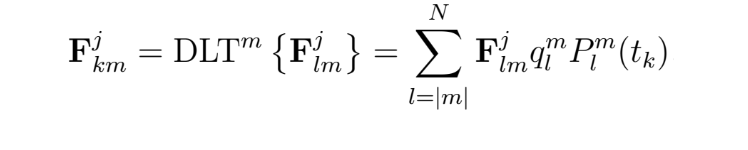

# Algorithm for Discrete Spherical Harmonic Expansion of 3D functions
 
This is an implementation of the Discrete Spherical Harmonic Expansion for 3D functions useful for some 3D inverse problems in imaging. The code bases on the algorithm for Discrete Spherical Harmonic Transform (DSHT) of functions on the unit sphere [1][2]. An improved version of this code has been employed for image reconstruction in 3D Compton Scattering Tomography [3]. The algorithm was developed in 2019 during a visit to the Laboratory ETIS (Equipes Traitement de l'Information et Systèmes CYU Cergy Paris University/ENSEA). 

# Circular Component Expansion in 2D

This is the 2D relative of the Spherical Harmonic Expansion in 3D. A function in $\mathbb{R}^2$  written in polar coordinates as $F(r,\phi )$ is decomposed in circular components. The function on a circle of radius r centered at the origin are then expanded as Fourier series of a $2\pi$-periodic function according

  

where

  

The discrete expansion can easily be carried out using the DFT-IDFT pair and the efficient FFT algorithm.

# Spherical Harmonic Expansion in 3D

The idea consists in slicing a function
$f: \mathbb{R}^3 \rightarrow \mathbb{R}$ in spheres centered at the origin. In spherical coordinates, the function is $F(r,\theta,\phi )$. For a given radius $r$, the values of the function lie on a sphere parametrized by angles $(\theta,\phi )\in\[0, \pi]\times[0, 2\pi)$. Functions on a sphere of radius $r$ can be expanded using Spherical Harmonic Expansion according

  

where the Spherical Harmonics are

  

and the radial components are

  

 where the overline denotes complex conjugation.
 

# Algorithm: Discrete Spherical Harmonic Expansion

 In the discrete case, the samples of function $F_{kn}^j = F(r_j,\theta_k,\phi_n )$ are decomposed to obtain the radial dependent coefficients of the DSHT expansion $(F^j_{lm}=F_{lm}(r_j))$. The IDSHT allows to recover the original function, the full pipeline is summarized as follows: 
 

  

where the forward-inverse pairs are used for the Discrete Fourier Transform (DFT-IDFT) and the Discrete Legendre Transform (DLT-IDLT). Index $j$ labels the radius of each sphere whereas indices $l$ and $m$ label the spherical component. Indices $n=-N,...,N$ and $k=1,...,N_\theta$ label the polar $\phi \in [0, 2\pi)$ and azimuthal angles $\theta\in\[0, \pi]$. Radius $r$ must cover the support of the function.

The algorithm employs the standard definition for the DFT-IDFT pair. The DLT-IDLT is defined as follows: 

  

  

where $N$ is the order of the expansion, $N_\theta$ the discretization in the azimuthal angle,  $P_l^m(t_k)$ are Legendre polynomials of degree $l=0,...,N$ and order $m=-N,...,N$, $t_k=\cos \theta_k$, $w_k$ is the Gaussian quadrature factor (calculated with a third party script), and

  

Refer to [3] for a more detailed description of the algorithm.

# Numerical reconstruction

The DSHT-IDSHT of order $N=256$ has been applied to a 3D Shepp-Logan phantom of size 64x64x64. This is a 3D version of the benchmark for testing algorithms in medical imaging. The figure shows six representative slices of the original object (column 1) and its reconstruction (column 2). The reconstruction exhibits some artifacts due to Gibbs phenomenon. Appropriate filtering [4] reduces this effect (column 3) and improves image quality. The 3D object is provided with the code and the main executes it automatically.

  

Percent RMSE (root mean squared error) is 0.12% for non-filtered and 0.28% for filtered reconstructions.

# References

[1] Driscoll J and Healy D 1994 Computing Fourier transforms and convolutions on the 2-sphere
Advances in Applied Mathematics 15 202–250

[2] Basko R, Zeng G L and Gullberg G T 1998 Application of spherical harmonics to image
reconstruction for the Compton camera Physics in Medicine and Biology 43 887–94

[3]  J. Cebeiro, C. Tarpau, M. A. Morvidone, D. Rubio and M. K. Nguyen, On a three-dimensional Compton scattering tomography system with fixed source, Inverse Problems, Special issue on Modern Challenges in Imaging, 37(2021), 054001 (23pp) , 2021. https://doi.org/10.1088/1361-6420/abf0f0 

[4] Taguchi K, Zeng G L and Gullberg G T 2001 Cone-beam image reconstruction using spherical
harmonics Physics in Medicine and Biology 46 127–138

